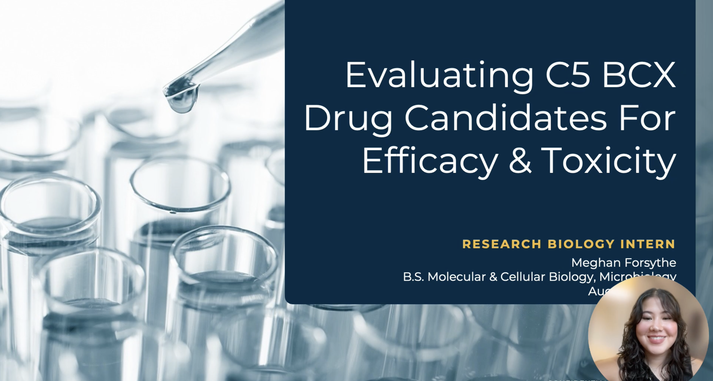
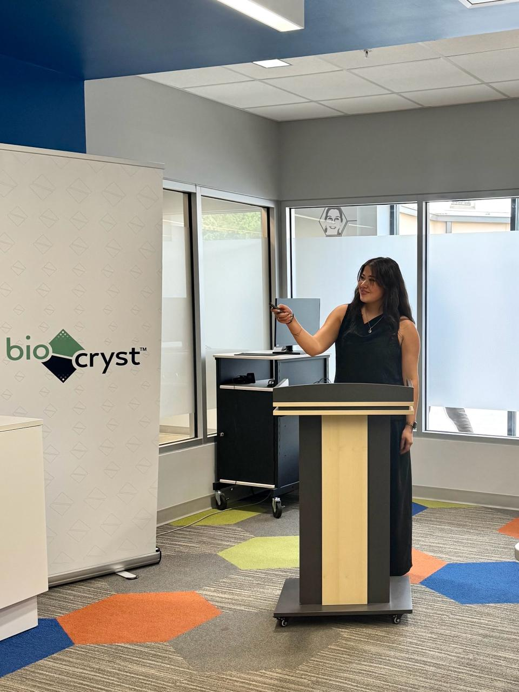

## Project Overview

BioCryst Pharmaceuticals Summer Internship provided comprehensive training in drug development and laboratory skills. The main goal was to evaluate C5 BCX drug candidates for both efficacy and toxicity using industry-standard assays.

## Techniques and Results

- Developed AP ELISA assay for functional drug candidate measurement.
- Performed ZMAC30 assay for toxicity and off-target effect assessment.
- Maintained and utilized tissue culture models to validate results.

## Internship Experience

This internship allowed for a deep understanding of the pharmaceutical workflow, from early-stage candidate evaluation to hands-on assay development and presentation to industry peers.

## Media

## Acknowledgements

Special thanks to the BioCryst mentors and lab team for providing training and support throughout this internship.

